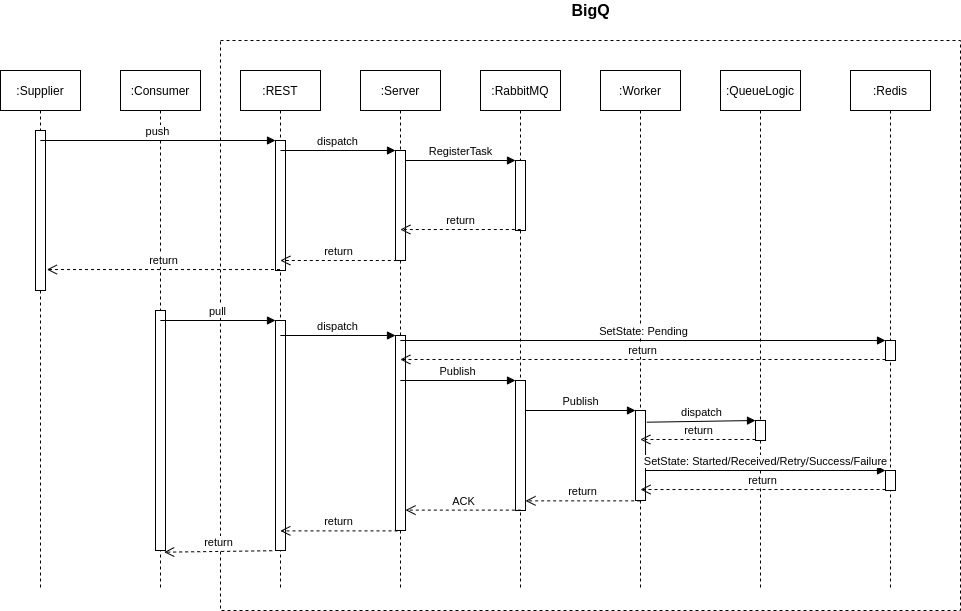

## BigQ
generic work queue to distribute tasks (WIP)

### Overview

- REST layer at the outermost of BigQ handles communication with external parties (supplier and consumer), written using Echo
- payload is in JSON
- JSON payload is serialized to Machinery tasks.Signature.Args as plain string before it is dispatched to the :Server
#### :Supplier push
- :Server registers task
- :Server creates new :Worker for each new RoutingKey with corresponding ConsumerTag
- once payload is received, it will be passed on to machinery, being processed when there is available :Worker
- on successful consume by :Worker, it will then queue the result back to another RoutingKey which
#### :Consumer pull
- if the payload contains an existing RoutingKey, :Server will dispatch a :Worker to consume queued task
- AMQP Exchange is set to direct exchange type to ensure that group pull does not result in duplicate results for consumers

### TODOs
- [ ] implementation (halfway)
	- [x] REST layer
		- [x] :Supplier push
		- [x] :Consumer on-demand pull
	- [ ] exchange instead of routing key for, with routing key to differentiate between queue logics
	- [ ] priority queue (might need to tweak machinery)
	- [ ] sample queue logic
	- [ ] register tasks via REST layer (probably not feasible, but depends on the task)
- [ ] integration tests
- [ ] Kubernetes setup

### scripts
`docker run --rm -d --name rabbit -p 5672:5672 rabbitmq:3`
`docker run --rm -d --name redis redis`
`go run cmd/manager/main.go` -> starts workers
`go run cmd/sender/main.go` -> starts REST API server for :Supplier and :Consumer
